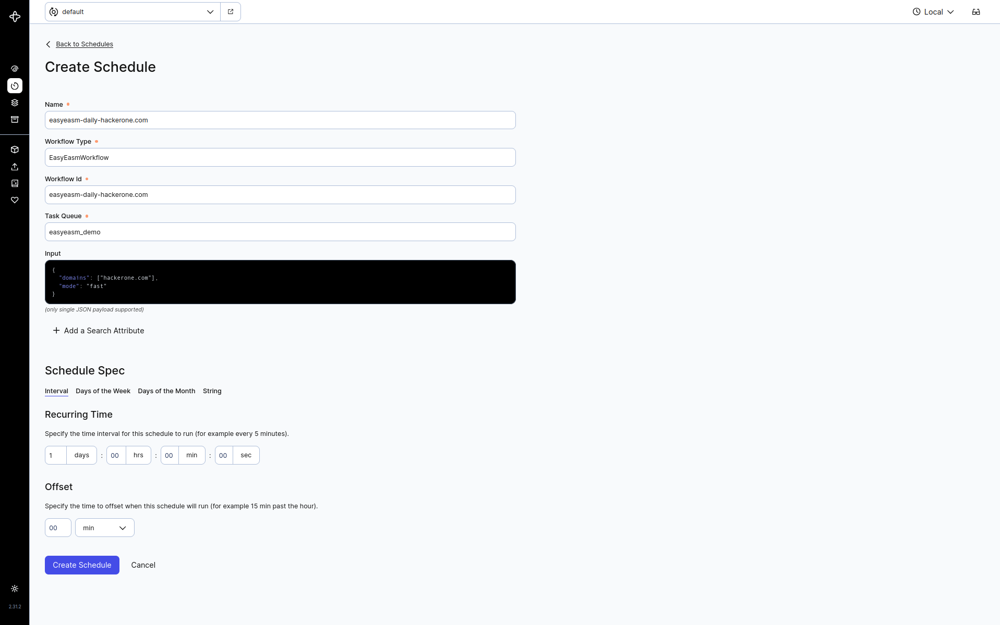

# C attack surface management (CASM)

This demo contains full self-contained demonstrator of domain scanning tool. The demonstrator consists of the following components:
* Neo4J database for results
* Temporal server as orchestrator
* Custom Temporal worker carrying out the scan
* Redis as an in memory database for worker to pass the scan results between tasks
* PostgreSQL database utilized by scanning tool

The demonstrator can be deployed with Docker. There is a `compose.yml` file spawning all components.

# How to run

## Running the app

After running:
```
docker compose up -d
```
you can verify that the following is available:

### Neo4J database
Neo4J should be available at http://localhost:7474/browser/. The default credentials are `neo4j:supertestovaciheslo`. If you want to change the
credentials you can do so in the `compose` file by chaging the `NEO4J_AUTH` variable. Please, do no forget to pass the
new credentials to the Temporal worker configuration as well (see [Configuration](#configuration))

### Temporalio server
Temporalio server should be available at http://localhost:8080/. You can watch the progress of your workflows there, or look for errors
if any problems occure. You can also create a scheduled scanning workflow there.

### Worker
Worker is a custom image build by this [project](Dockerfile). Worker has installed:
- Python 3.12: workflow is implemented in Python 3.12
- Go 1.23.1: necessary for scanning tools
- [EasyEASM](https://github.com/g0ldencybersec/EasyEASM) - the main scanning tool triggered on worker by workflow with the following prerequisited installed in image as well:
  - alterx@latest
  - amass@master: fixed at V3 version (available also as V4)
  - dnsx@latest
  - httpx@v1.6.0: important! Different versions of httpx can lead to wildly different results and can break this demonstrator
  - oam_subs@master
  - subfinder@latest

You can rebuild this worker by running:
```
  docker compose up -d --build
```

# Configuration
Configuration files are located in the [config](config) and in [docker](docker) folders. Config in [config](config) serves for local deployment of the worker
and for running the client to trigger on-demand workflow. 

Configs in [docker](docker) folder are used by dockerized worker:
- config.yaml: config for worker, same format as in the local deployment
- amass_config.yaml: config file for worker, configures amass to know where is the postgresql located


The configuration is rather simple, it contains the following:

```yaml
temporal:
  url: localhost:7233
  namespace: default
  task_queue: easyeasm_demo

neo4j:
  password: supertestovaciheslo
  bolt: bolt://localhost:7687
  user: neo4j

redis:
  host: localhost
  port: 6379

```
- temporal:
  - url: url of Temporal server GRPC service
  - namespace: namespace on Temporal server
  - task_queue: task_queue used by Client and Worker
- neo4j:
  - password: password for Neo4j user
  - bolt: url of Neo4j instance
  - user: Neo4j user username
- redis:
  - host: url of Redis
  - port: port where Redis listens

## Triggering workflow

> [!WARNING]
> Be aware that the point of this project is to run scans against live domain names. This means that you should select your
> targets **VERY** carefully. Generally, it is advised against running the workflow against random targets available on the Internet.
> 
> The workflow was tested against hackerone.com very cautiously. The target was selected because the
> authors demonstrated EasyEASM against it at their presentation at [DefCon 31](https://www.youtube.com/watch?v=hx0dBo-zKE8).

This project provides user with a prepared client that can connect to Temporal and trigger workflow on selected targets. If you want
to run this client, you need to do the following:

### Dependencies
This project utilizes Poetry. It is necessary to have Python 3.12 installed together with poetry. To create the venv and install all
dependencies, run:
```
poetry install
```

### Running the scan
Client does not have its own separate configuration right now. To try it out, you can edit the source file directly [client.py](easyeasm_demo/client.py).
```python
async def main() -> None:
    config = AppConfig.get()
    temporal_client = await Client.connect(config.temporal.url, namespace=config.temporal.namespace)
    domains = ["hackerone.com"]
    mode = "fast"
    scan_uuid = uuid.uuid4().hex
    input_ = CASMInput(domains=domains, scan_uuid=scan_uuid, mode=mode)
    await temporal_client.start_workflow(
        EasyEasmWorkflow,
        id=scan_uuid,
        arg=input_.to_dict(),
        task_queue=config.temporal.task_queue,
    )
```
You can replace the `domains = ["hackerone.com"]` with your own target domains. It is not necessary to pass in `mode` and `scan_uuid`,
if not provided, workflow will generate its own `scan_uuid` and use the default mode - `fast`.
To trigger the workflow, run:
```sh
python -m easyeasm_demo.client
```

### Verifying results
If you triggered a workflow and want to see if it succesfully finished, you can:

1) Check the workflow status in Temporal server via GUI
2) Run Cypher queries on Neo4J to look up the results

This is an example of a NEO4J query fetching all IP addresses and their resolution to domain names.
```cypher
MATCH (ip:IP)-[:RESOLVES_TO]-(d:DomainName) RETURN ip,d
```


# Setting up scheduled workflow
You can create periodic scheduled scans via Temporal GUI.

